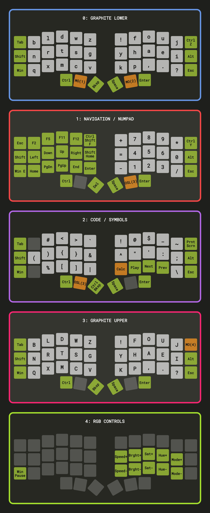

# Unicorne

I use this layout for my [Unicorne LP by Boardsource](https://www.boardsource.xyz/products/unicorne-LP)

*Image generated with keyfab (https://github.com/jaroslaw-weber/keyfab). Edit code and run locally for best results.*

# 0: Graphite Lower

I use the [Graphite keyboard layout](https://github.com/rdavison/graphite-layout). The main homerow keys are NRTS and HAEI, so all layers are focused around these positions. I originally used Colemak DH, which was a massive improvement over QWERTY, but still had some awkward combinations.

**Ctrl Z** gives me quick access to Undo and Redo is mapped to the same key one layer up.

The **MO(1)** and **MO(2)** keys will change layers to Navigation or Code while held individually.

# 1: Navigation / Numpad

When using a split keyboard, it is important that all of the navigation keys are on the side opposite the mouse. This allows me to click code with my right hand and navigate it with my left at the same time. 

**Ctrl-Shift-F** is used to bring up the Search In All Files bar in VS Code.

**Ctrl-F** is used for a faster find with my left hand.

**Win-E** opens a Windows File Explorer window.

I added an **Enter** key since I want to be able to use it while navigating with the mouse.

**Delete** is in an awkward position while holding the left layer button, but I rarely use it.

**Ctrl Y** gives me quick access to Redo and Undo is mapped to the same key one layer down.

Pressing the **OSL(3)** thumb key on the right (at this point I am still holding the left layer key) will toggle the Uppercase layer. I can let go of both thumb keys and type a single uppercase letter or hold both to continue typing in uppercase.

# 2: Code / Symbols

The 8 symbols on the homerow locations are my most used coding symbols

**Calc** opens the Windows Calculator. The Media keys let me control music in Spotify.

Pressing the **OSL(3)** thumb key on the left (at this point I am still holding the right layer key) will toggle the Uppercase layer. I can let go of both thumb keys and type a single uppercase letter or hold both to continue typing in uppercase.

# 3: Graphite Upper

Keeping the uppercase letters on a separate layer triggered by the thumbs allows me to touch type as normal since the Shift key is on the side and would normally throw things off.

An alternative approach would be to swap Ctrl and Shift so I can write uppercase while holding Shift. The downside of this is that you have to stretch to capitalize letters like B, while the OSL key allows me toggle the caps layer, lift my thumbs, and then type a little more comfortably.

I use the top-right key to trigger another layer that I use to control my keyboard's RGB.

# 4: RGB Controls

# Build Firmware with QMK

I use the [QMK Userspace](https://docs.qmk.fm/#/newbs_external_userspace) system to build my QMK firmware. This allows me to keep my custom keymap separate from the qmk_firmware repository.

Install [QMK SYS](https://github.com/qmk/qmk_distro_msys/releases/latest)

Run QMK SYS

This will download the latest qmk_firmware repository to the specified path 
`qmk setup -H F:/Projects/Frank/Keyboard/qmk_firmware`

Clone or download my custom userspace. It is just a fork of the [template](https://github.com/qmk/qmk_userspace). In my case, I keep it at `F:/Projects/Frank/Keyboard/qmk_userspace` 
`git clone https://github.com/frankprogrammer/qmk_userspace.git`

`cd qmk_userspace`

Enable the QMK Userspace system and points it to the folder we are in. This overlays the qmk_userspace folder on top of the qmk_firmware folder 
`qmk config user.overlay_dir="$(realpath .)"`

This generates boardsource_unicorne_frankprogrammer.uf2 
`qmk compile -kb boardsource/unicorne -km frankprogrammer`

# Install Firmware
Unplug the Unicorne from the PC. On the left half, hold the top-left key and connect the USB-C cable from the PC. A folder should pop open. Drag the uf2 file to this folder. The Unicorne should reboot. 

Repeat this process, but plug into the right half while holding the top-right key of the right half. 

Plug the cable back to the left half afterwards. 

# VIA
This firmware has VIA enabled. It allows you to update your keymap without having to recompile and flash every time. You can use VIA at https://usevia.app/. 

VIA has an option to save your layout, but it is in a custom format. You can convert it to the QMK keymap.json format with: 
`qmk -v via2json -kb "boardsource/unicorne" -l "LAYOUT_split_3x6_3" -km frankprogrammer -o keymap.json keymap-via.json`

## Resources
[What makes a keyboard layout good?](https://semilin.github.io/blog/2023/layout_quality.html)

[Keyboard layout family tree](https://www.reddit.com/r/KeyboardLayouts/comments/11g3xlx/keyboard_layout_family_tree/)

[Oxey's Layouts](https://oxey.dev/index.html)

[The QMK Tutorial](https://docs.qmk.fm/#/newbs)

[MonkeyType](https://monkeytype.com/)

[SpeedTyper.dev](https://speedtyper.dev/)
